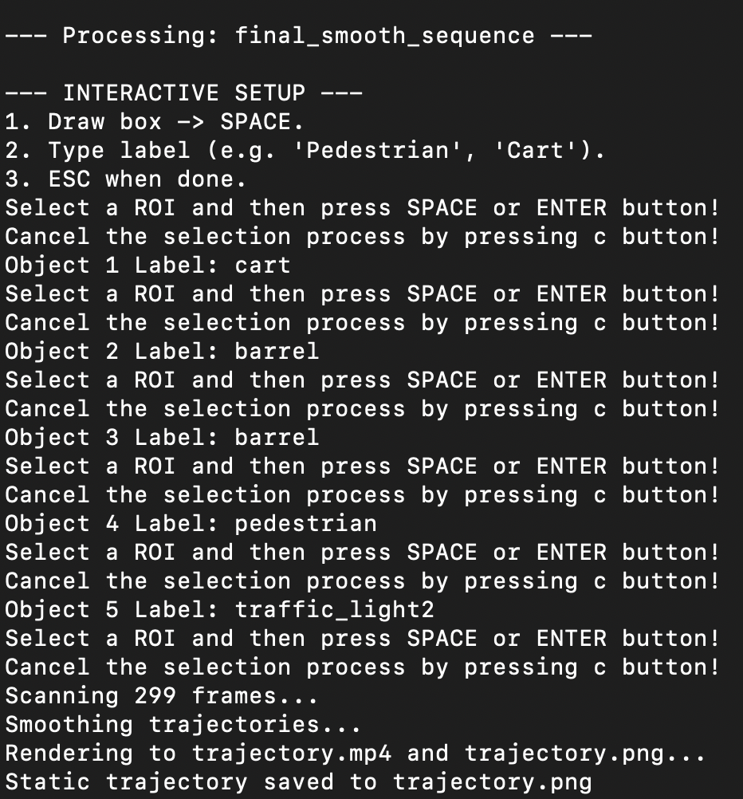

# Visual Odometry & Multi-Object Tracking in BEV

## Overview
This project implements a visual odometry system that estimates the ego-vehicle's trajectory by tracking a static reference point (a traffic light) in 3D space. Additionally, it features an interactive tracker to locate and plot dynamic objects (pedestrians, golf carts) and static obstacles (barrels) in a Bird's Eye View (BEV) map.

The system fuses **RGB imagery** with **depth point clouds** to transform camera-frame coordinates into a stabilized "World Frame," visualizing the vehicle's path relative to the environment.

## Example Terminal Session
This image shows the terminal output during the interactive setup (where you input labels for selected objects) and the frame-by-frame processing loop.

## Method & Approach

### 1. Coordinate System Transformation (Part A)
The core challenge is converting the **Camera Coordinate System** (attached to the moving vehicle) into a fixed **World Coordinate System**.

* **Input Data:** 3D point clouds (`.npz`) where $X$ is forward, $Y$ is right, and $Z$ is up (relative to the car).
* **World Frame Definition:**
    * **Origin (0,0):** Defined as the ground position directly below the reference Traffic Light.
    * **Orientation:** At frame $t=0$, the World $X$-axis is aligned with the line connecting the car and the traffic light.
* **Transformation Logic:**
    1.  We extract the 3D position of the traffic light ($P_{light}$) relative to the camera for every frame.
    2.  We calculate a rotation matrix $R$ based on the angle of $P_{light}$ at $t=0$ to align the axes.
    3.  The Ego-Vehicle position in the World Frame is calculated as the inverse of the light's position, rotated by $R$.

### 2. Depth Estimation & Noise Handling
Raw depth data often contains noise, `NaN`s, or "holes" (zeros). To ensure robust tracking:
* **Patch Sampling:** Instead of relying on a single pixel, we sample a $5 \times 5$ patch around the bounding box center.
* **Filtering:** We filter out infinite and zero values.
* **Median Aggregation:** We use the spatial median of the valid points in the patch. This creates a robust centroid that is resistant to salt-and-pepper noise in the depth map.

### 3. Multi-Object Tracking (Part B)
To incorporate other elements into the BEV:
* **Interactive Initialization:** The user manually selects objects (carts, pedestrians) in the first frame.
* **Tracking Algorithm:** We utilize **CSRT** (Channel and Spatial Reliability Tracking) via OpenCV. It is chosen for its high accuracy in handling scale changes and occlusion compared to KCF.
* **Projection:** Dynamic objects are positioned relative to the calculated Ego-position, allowing both the car and objects to move independently in the map.

### 4. Trajectory Smoothing
Due to sensor noise and vehicle vibration, raw frame-to-frame calculations can be jittery.
* **Technique:** A **Rolling Window Mean** (window size = 15 frames) is applied to both the Ego and Object trajectories.
* **Jump Rejection:** A logic check prevents physics-defying "teleportation" by ignoring position updates that exceed a maximum Euclidean distance (5.0m) between consecutive frames.

## Assumptions
1.  **Static Reference:** The traffic light identified in `bbox_light.csv` is assumed to be perfectly static in the real world.
2.  **Flat Ground Assumption:** For the BEV (2D) plot, we ignore the vertical ($Z$) component differences between the car, the light, and other objects.
3.  **Synchronized Data:** We assume the RGB frames and Depth `.npz` files are perfectly synchronized in time.

## Results
The script generates two output files:

1.  **`trajectory.png`**: A high-resolution static plot showing the full path of the ego vehicle and tracked objects.
2.  **`trajectory.mp4`**: A video visualization combining the RGB camera view (with bounding boxes) and the live-updating BEV map.

### Visual Guide
* **Blue Line:** Ego-Vehicle Trajectory.
* **Yellow Star:** The Traffic Light (World Origin).
* **Cyan/Magenta/Orange:** Optional tracked objects (Pedestrians, Carts, Barrels).
